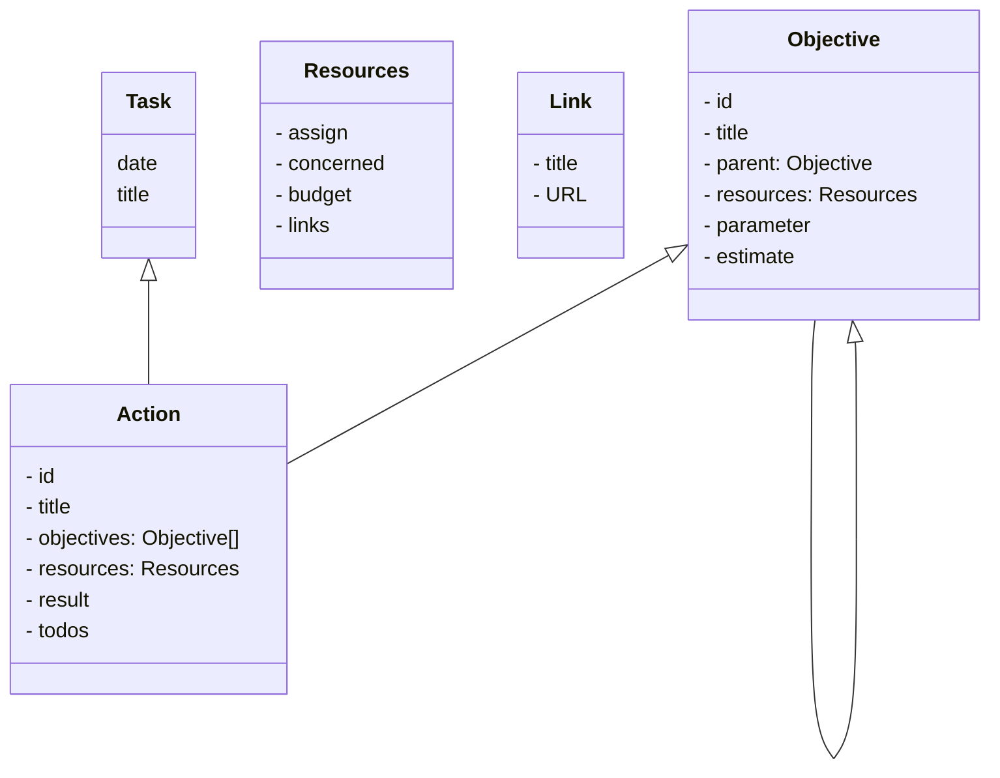
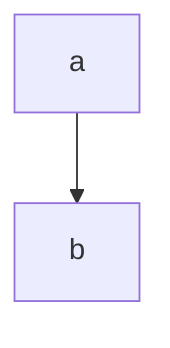

# pjfu
プロジェクト譜を使ったタスク管理

# やりたいこと
- 全体から掘っていく
- 施策を検索する
- 編集する
- リンクを探す
- 課題を探す
- TODO一覧
- TODOから施策へ

# ドメインモデル


## 設計コンセプト
- 言語: typescript
- ライブラリ
  - FW: vue
  - 描画: mermaid
  - バンドラー: percel

- データの保存先は選べるように
- データの読み込みは初回1回のみ。あとはリロードするまで同期なし




# ビルド
```
parcel --out-dir ./dist/js/index ./src/pjfu.ts
```

# Googleスプレッドシート（gas)で利用する方法
- スプレッドシートを作る
- objectivesシートとactionsシートを作る
- スクリプトエディタを開く
- ./dist/gas/gas.jsの内容をスクリプトエディタにコピペする
- [ウェブアプリケーションとしての導入]で公開
- 生成されたサイトを開く